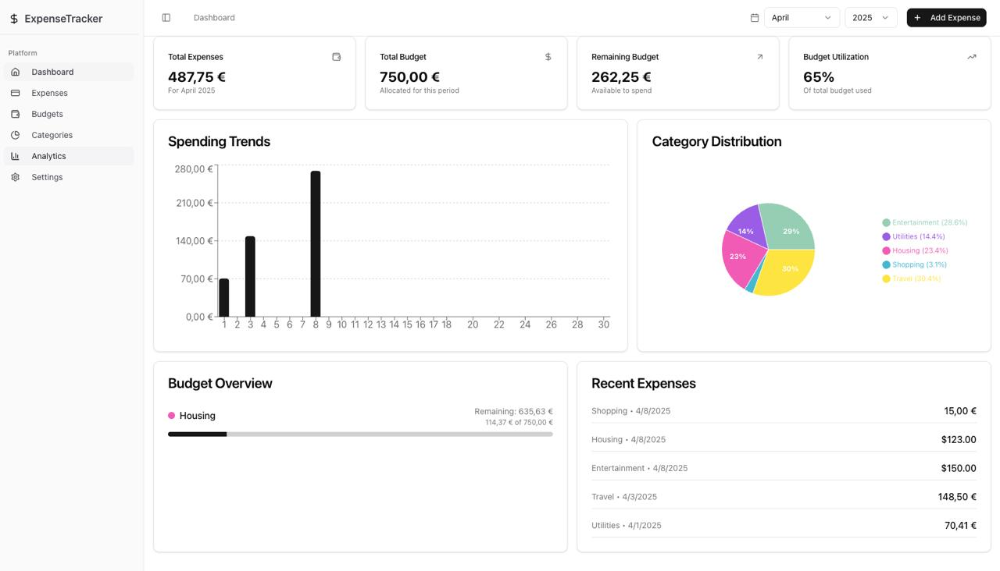
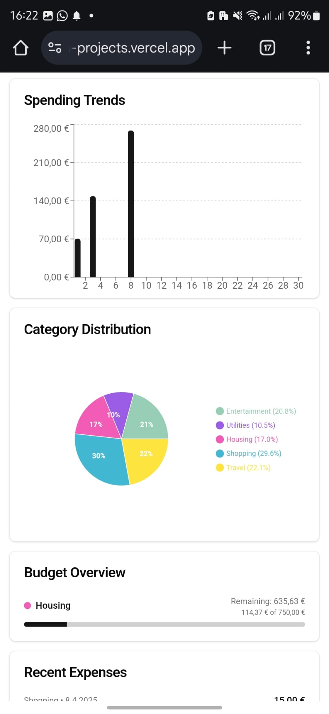
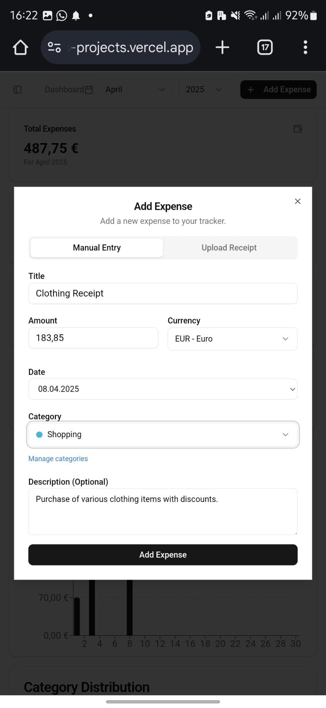

# Expense Tracker App

A modern expense tracking application built with Next.js, Supabase, and Clerk Authentication.

## Demo

Here's a look at the Expense Tracker App in action:

### Dashboard View

*The main dashboard showing expense analytics, budget utilization, category distribution, and recent expenses.*

### Mobile View & Add Expense Feature
<p align="center">
  
  &nbsp; &nbsp; &nbsp; &nbsp;
  
</p>
<p align="center">
  <em>Mobile interface (left) and Add Expense feature (right)</em>
</p>

## Features

- Track expenses and income with category management
- Set and monitor budgets with visual progress tracking
- Responsive design works on desktop and mobile
- Secure authentication with Clerk
- Visual analytics with spending trends and budget comparisons
- Light/Dark mode
- Multi-currency support with automatic conversions
- Receipt scanning with AI-powered data extraction

## Tech Stack

- **Frontend**: Next.js 14 with App Router
- **Database**: Supabase (PostgreSQL)
- **Authentication**: Clerk
- **Styling**: Tailwind CSS with shadcn/ui
- **Charts**: Recharts
- **AI Integration**: OpenAI for receipt processing

## Deployment Options

You can deploy this app in two ways:

### Option 1: Serverless Deployment (Vercel + Supabase)

This is the recommended approach for production deployments.

1. **Set up Supabase**
   - Create a new project at [supabase.com](https://supabase.com)
   - Get your API keys from the Supabase dashboard
   - Run the SQL scripts from the `supabase/migrations` folder

2. **Set up Clerk**
   - Create an account at [clerk.dev](https://clerk.dev)
   - Create a new application and get your API keys

3. **Deploy to Vercel**
   - Fork this repository to your GitHub account
   - Import your repository in Vercel
   - Set up the following environment variables:
     ```
     NEXT_PUBLIC_CLERK_PUBLISHABLE_KEY=your_clerk_publishable_key
     CLERK_SECRET_KEY=your_clerk_secret_key
     NEXT_PUBLIC_SUPABASE_URL=your_supabase_url
     NEXT_PUBLIC_SUPABASE_ANON_KEY=your_supabase_anon_key
     OPENAI_API_KEY=your_openai_api_key
     SUPABASE_SERVICE_ROLE_KEY=your_supabase_service_role_key
     ```
   - Deploy!

### Option 2: Local Development with Docker Compose

Perfect for development or self-hosting.

1. **Clone the repository**
   ```bash
   git clone https://github.com/yourusername/expense-tracker-app.git
   cd expense-tracker-app
   ```

2. **Set up environment variables**
   ```bash
   cp .env.example .env.docker
   ```
   Edit the `.env.docker` file to include your Clerk and OpenAI API keys.

3. **Start the Docker containers**
   ```bash
   docker-compose up -d
   ```

4. **Access the application**
   - Web App: [http://localhost:3000](http://localhost:3000)
   - Supabase Studio: [http://localhost:9000](http://localhost:9000)

5. **Essential Docker commands**
   ```bash
   # View logs
   docker-compose logs -f app
   
   # Stop all containers
   docker-compose down
   
   # Rebuild containers (after changes)
   docker-compose up -d --build
   ```

## Local Development Without Docker

If you prefer developing without Docker:

1. **Install dependencies**
   ```bash
   npm install
   ```

2. **Set up environment variables**
   Create a `.env` file with the necessary variables (see `.env.example`).

3. **Start Supabase local development**
   ```bash
   npx supabase start
   ```

4. **Run the development server**
   ```bash
   npm run dev
   ```

## Environment Variables

### Required Variables

```env
# Clerk Authentication
NEXT_PUBLIC_CLERK_PUBLISHABLE_KEY=your_clerk_publishable_key
CLERK_SECRET_KEY=your_clerk_secret_key

# OpenAI (for receipt processing)
OPENAI_API_KEY=your_openai_api_key

# Supabase Configuration
NEXT_PUBLIC_SUPABASE_URL=your_supabase_url
NEXT_PUBLIC_SUPABASE_ANON_KEY=your_supabase_anon_key
SUPABASE_SERVICE_ROLE_KEY=your_service_role_key
```

## Database Schema

The application uses the following main tables:
- `users`: User information and preferences
- `user_settings`: User configuration settings
- `categories`: Expense categories with customizable colors
- `expenses`: Individual expense records with amounts and categories
- `budgets`: Budget limits for expense categories

## Troubleshooting

### Common Issues

- **Authentication Issues**: Verify your Clerk API keys in the `.env` file
- **Database Issues**: Check Supabase connection strings and make sure tables exist
- **Receipt Processing**: Verify your OpenAI API key is valid and has sufficient credits

### Docker Troubleshooting

- **Port Conflicts**: Ensure ports 3000, 5432, 8000, and 9000 are available
- **Container Errors**: Check logs with `docker-compose logs -f`
- **Rebuild Containers**: Use `docker-compose up -d --build` after code changes

## Contributing

Contributions are welcome! Please feel free to submit a Pull Request.

## License

This project is licensed under the MIT License - see the LICENSE file for details.